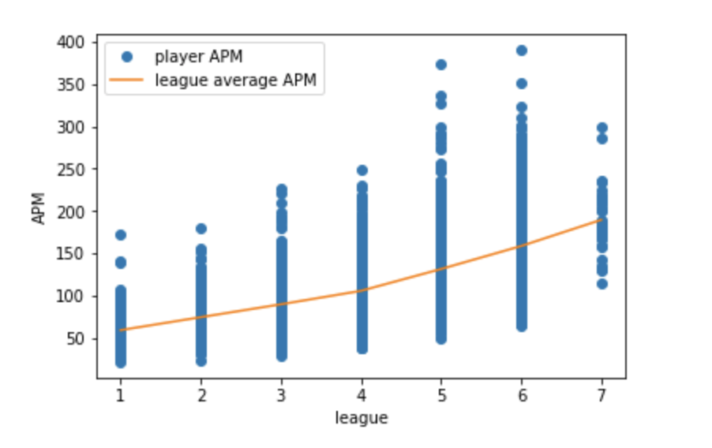
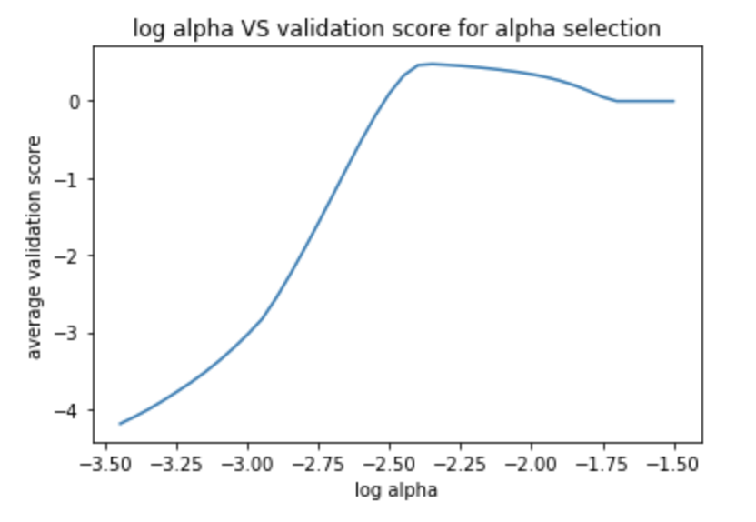
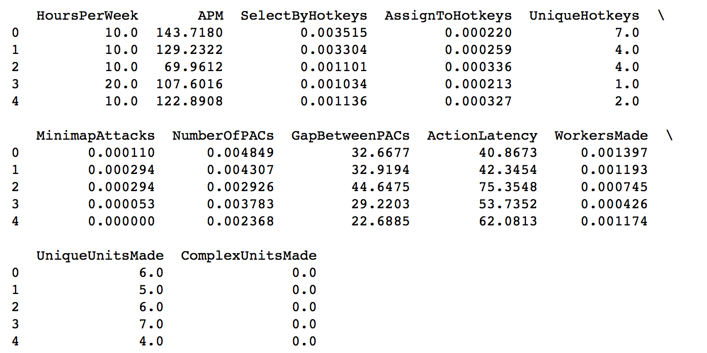

## Gamers Performance Analysis 

### Background

The project is based on the data set [Skill Craft Dataset](http://archive.ics.uci.edu/ml/machine-learning-databases/00272/SkillCraft1_Dataset.csv). I want to analysis what factors are important to a gamer's performance, and figure out how well they can be used to predict a gamer's performance. The column `LeagueIndex` in the dataset indicartes the overall performance of gamers, which is the response variable in our analysis. Additionally, around 20 attributes are included in the dataset which can be used as our explanatory variables. 

### Analysis

##### Step 1: Download data and Clean data

I downloaded the data. After doing some initial scan, I found out that there are some missing data in the dataset. Since the number of missing data is minimal (roughly 2%) comparing to the number of total observations in the dataset, I deleted the instances associated with the missing data. Additionally, I deleted the column `GameID` since it is irrelevant to our analysis. 

##### Step 2: EDA 

In order to verify the dataset, I created a scattere plot of league level and player APM. I choose APM, because it is common known there is a strong relationship between APM and gamers' league levels. If the dataset is valid, players' league levels must be positively correlated with players' APMs. Here is the figure:

As shown in figure above, player's APMs is obviously positively correlated with player league. Hence, this dataset is proved to be reasonable.

#### Step 3: Train Data

I seperated the data into two groups, training data and testing data. I did a cross-validation (k-fold 10) on the training data in order to get the best hyperparameter $\alpha$ for Lasso model. As shown in figure below, validation score reaches the peak when $\alpha$ equals to $0.00446684$. Hence, I chose $0.00446684$ for $alpha$ as the hyperparameter in Lasso model.

Then, I trained Lasso model with the $\alpha$ ($0.00446684$) on entire the training data and outputed selected features.

As shown in the table above, 12 features are selected by the Lasso model as meaningful for predicting the league of a player. Features like "APM" and "ActionLatency" are selected as expected since they are supposed to be the hard skill of a good player. Supprisingly, age is not selected as a valid feature, even though we all know that top player are likely to be younger. This could be because either age is irrelevant, or age is substituted by some other more meaningful features.

#### Step 4: Test Data and Result

After 12 features are selected, I applied the trained Lasso model to the untouched testing data and compared training score and testing score. The testing score (0.5055) is close to training score (0.5426). Hence, I assume a robust and reliable model is made for predicting player skill.

### Conclusion

After doing the analysis, I can conclude that using the gamers' behavioural data to predict the gamers' performance is effective and reasonable. 

